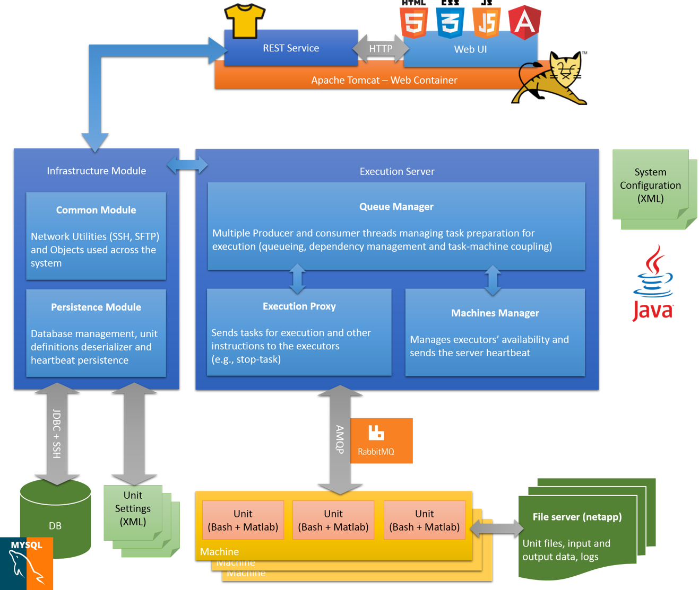

# Ubnogo - A System for Executing and Managing Neuroscience Analyses
Tel Aviv University 2016 | Electrical and Computer Engineering Final Project

This is a repository for with the code and documentation of our final project for B.Sc. in Electrical Engineering and Computer Science at Tel-Aviv University (Course no. 0512.4000). 

<b>Abstract:</b> we developed a system for executing and managing analyses on large sets of data, typical to neuroscientific experiments. Our system includes a main Java server, a RESTful HTTP service, a Web-UI, and multiple Java server instances that execute analyses as Bash-Matlab scripts. The system supports running many analyses of various kinds on different sources of data in parallel by multiple users. The system will be used for the benefit of the Sagol School of Neuroscience.

This project is licensed under the terms of the MIT license.

Project architecture and technologies

UI screen shot

